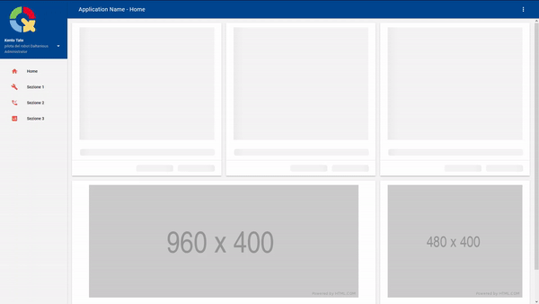

# Material Design dashboard template

- [Spring Boot](https://spring.io/)
- [Material Design Lite](https://getmdl.io/)
- [JQuery](https://jquery.com/)
- [ChartJS](https://www.chartjs.org/)
- [Docker](https://www.docker.com/)

La parte frontend - contenuta nelle directory *static* e *templates* - è completamente indipendente dalla parte di 
backend, e l'interazione avviene in maniera asincrona attraverso l'uso di [RESTful API](https://en.wikipedia.org/wiki/Representational_state_transfer) 
messe a disposizione dal backend stesso.

La rappresentazione dei dati provenienti dalle API avviene attraverso ChartJS, utilizzando dei 
[skeleton screens](https://uxdesign.cc/what-you-should-know-about-skeleton-screens-a820c45a571a) per l'attesa.

Se utilizzata all'interno di Docker, vengono creati due container: uno per il webserver, l'altro per la base dati